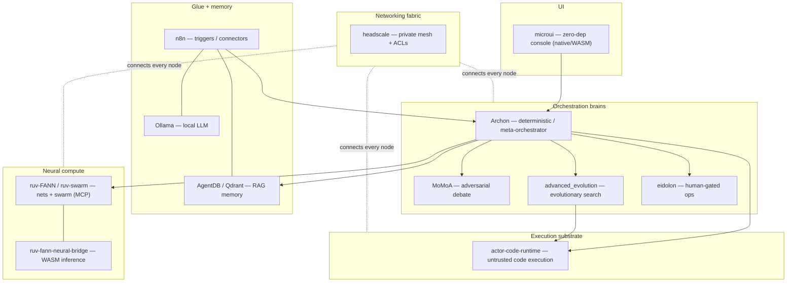
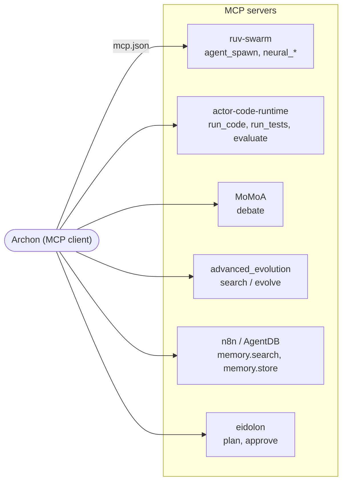
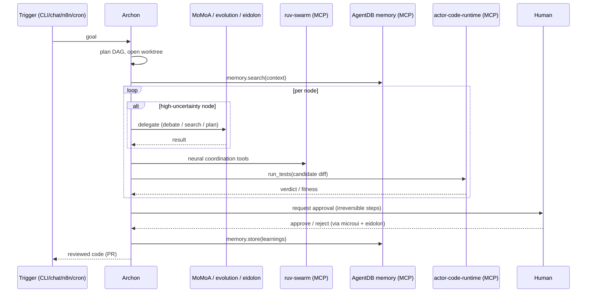
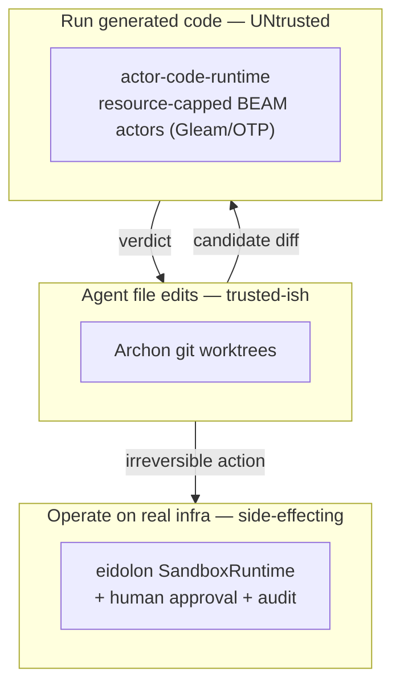

# Architecture

Diagrams for the structures described in [`SPEC.md`](SPEC.md). All diagrams are Mermaid.

## Layer stack

## The MCP bus

Every cross-layer call is an MCP client→server hop. Archon is the primary client.

The Phase-1 edge (`Archon → ruv-swarm`) is live today with **one JSON file**. The rest of the
roadmap repeats this exact pattern.

## Request lifecycle

## Execution-substrate boundary

Three isolations, three threat models (see [DECISIONS D2](DECISIONS.md#d2--the-execution-substrate-boundary)):

